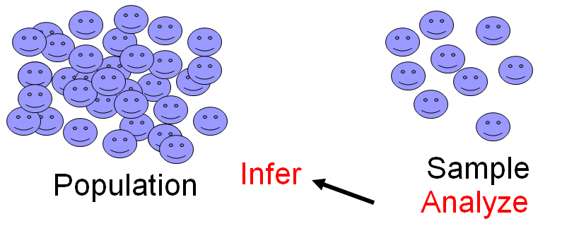
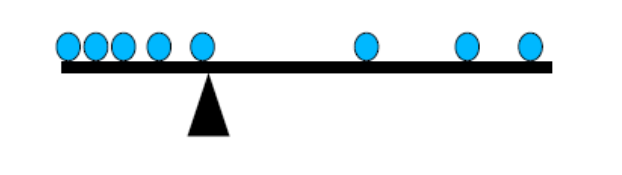

#Introduction to Biostatistics Block1

## Statistics

### Definition

"Statistics" is an inclusive term describing the...

* Collection
* Organization
* Analysis
* Interpretation

of **DATA** to answer questions and make decisions.

### Sample = Subset

A subset ('sample') of the larger population is studied in depth to gain information, which is then inferred back to the population as a whole.



### Avoiding bias

* Ideally, a sample should be _representative_ of the population as a whole.
* **_Representative_**: what is true of the population is also true of the sample.
* This is more likely to happen if sampling process is free of bias.
* **_Bias_**: favoring of certain members of the population over others.

Examples of biased samples

* All internet polls assume people have internet access, doesn't poll those who don't.
* Survey of mothers on welfare - those who voluntarily had job training means they are more motivated anyway.

### Source of Bias

* Human sampling: Frequently non-random...
* Sampling every 50th item from a production line - if there are periodic, seasonal, or systematics effects, the sampling process will be biased.
* **_Solution_**: a simple random sample- every item in a population has the same chance of being selected in the sample.

### Measurement scales

* Nominal Scale
  - Classified by quality (attribute) rather than numerical scale
    - Male, Female
    - Eye color: brown, green, or blue
    - Genetic phenotype
*Ordinal Scale
  - Have relative diff.
  - Ordering or ranking exists.
    - Size of 5 cell types might be 1, 2, 3, 4, 5 to denote their **magnitudes** relative to other.
    - Likert scale rating one's overall health on a scale of 1-5
  - Exact measurements are not provided
* Interval Scale
  - Equal intervals between units. (Only the scales need to be correct.)
  - Arbitrary zero point; i.e. negative numbers are allowed.
    - Degrees Fahrenheit; sea level
* Ratio Scale
  - Interval scale with absolute zero (no negative numbers); i.e. zero indicates complete absence of the characteristic.
    - Height, weight, age, absolute temperature, etc.
* Discrete variables
  - Variable that can take on only certain discrete values.
  - 1,2,3 - integer only
* Continuous variables
  - 1.2, 2.4, 7.888 - it can take on any real value.
* Nominal data are discrete.
* Ordinal, interval, and ratio data can be discrete or continuous.
* Scale of measurement determines descriptive statistics
  - Nominal: frequency(%) only... mode
  - Ordinal: frequency(%)... median and range
  - Interval: addition and subtraction... mean and variance
  - Ratio: all mathematical and statistical procedures are allowed.

### Qualitative vs quantitative
* Qualitative
  - Deals with descriptions
  - Data that can be observed but not measured.
  - Ex: colors, textures, smells, tastes, appearance, beauty, etc.
  - **Qual**litative -> **Qual**ity
* Quantitative
  - Deals with numbers
  - Data can be measured
  - Ex: length, height, area, volume, weight, sped, time, temp., humidity, sound levels, cost, members, ages, etc.
  - **Quantit**ative -> **Quantit**y

### Hospital study scenario
* Study consisting of 2560 patients admitted to a hospital during past year revealed that, on average, the patients lived 15 miles from the hospital.
  - What is the sample?: The sample is 2560 patients that were admitted to hospital last year.
  - What is the population?: The entire group of people who were admitted as patient in the hospital.
  - What is the variable of interest?: The distance of patient's house from hospital.
  - What measurement scale was used?: Distance in miles. It's a ratio scale and a continuous variable.
  - What is the sample size?: The sample size is n = 2560.
  - How might data be collected?: By using random electronic health records indicating the patient's address and employing google earth to calculate the distance from hospital to their current address.

### Measures of Central Tendency
#### Mean
$$\mu = \frac{{\sum\limits_{i}\limits^{N}} X_{i}}{N}$$
Sum of individual scores (Xi) divided by the total number of observations (N).



  - Advantages of the sample mean
    - It takes all values in the sample into account.
    - Unique. Each sample has only one mean.
    - Sum of X minus the mean is zero, the mean acts as a balancing point.
  - Disadvantages of the mean.
    - Cannot be used on nominal, ordinal, qualitative data
      - Ex.: There's no such thing as a "mean gender" for a group of 16 females and 4 males.
  - Can be affected **STRONGLY** by outliers.
    - Ex.: 10 people make \$10,000 and one guy makes \$1,000,000
```{r}
m <- (10000*10+1000000)/11
print(m)
```


    The mean = $100,000, which does not reflect the salary of anyone in the sample.

#### Median

  - Identifies midpoint of data when they are sorted from highest to lowest.
  - If even number of observations for midpoint, take average of those two midpoints.
- Advantages of Median
  - Works on ordered data (ordinal) and quantitative data. (Same median)
  - Is unaffected by outliers
    - In prior income example wherein mean = \$100,000, the median = \$10,000, which better reflects the typical salary from that sample.
  - Similar to mean, median is unique: a sample has only one.
- Disadvantage of Median
  - Not affected by changes in data away from center.
    - Even if highest income in previous example drops to $25,000, median income remains the same.
  
  
#### Mode
- Most common value.
- Advantage
  - Works with categorical data (nominal)
- Disadvantage
  - May not be unique; e.g. bi-modal or multi-modal
  - May not lie near the center.